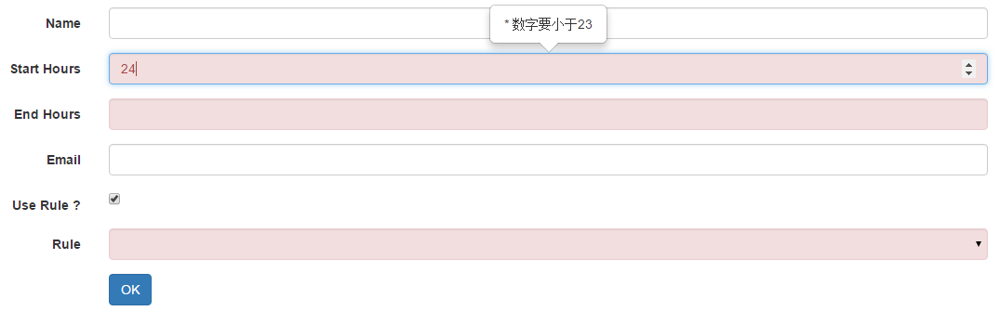

AngularJS 1.4.x 原生表单验证扩展
===

## 扩展内容

1. 支持Bootstrap风格的错误提示
1. 支持即时错误反馈（鼠标离开时验证）

## 验证类型
 
 支持的类型 |  参数 | 示例
 -------------- | ------------------- | ------------------------------------------
 必填 | required | &lt; input name="demo" ng-model="demo" required class="form-control" /&gt;
 数字 | type="number" |  &lt; input name="demo" ng-model="demo" type="number" class="form-control" /&gt;
 Email | type="email" |  &lt; input name="demo" ng-model="demo" type="email" class="form-control" /&gt;
 最大最小值 | min/max |  &lt; input name="demo" ng-model="demo" type="number" min="0" max="23" class="form-control" /&gt;
 最大最小长度 | min/max |  &lt; input name="demo" ng-model="demo" ng-minlength="3" ng-maxlength="8"  class="form-control" /&gt;
正则 | pattern [r-msg] |  &lt; input name="demo" ng-model="demo" pattern="(([0-9])|(1\d)|(2[0-3]))" r-msg="请输入0-24间的数字"  class="form-control" /&gt;

* r-msg : 自定义正则错误提示，可以不写
* 带条件的验证：如当xx条件成立时需要验证，否则不需要：

         <input name="demo" ng-model="demo" required class="form-control" ng-if="otherModelName==true" />

## 用法

HTML：

    <form name="<form name>" novalidate>
        <X [type="<HTML5 support type>"] ng-model="model name" [min=""] [max=""] [ng-minLength=""] [ng-maxlength=""] [required] [pattern=""] [r-msg=""] />
        ...
    </from>
 
JS：

    angular.module('<module name>',['ez-angular-validation'])
        .controller('<controller name>', function ($scope,EV) {
    
            EV.init($scope,"<form name>");
    
            $scope.<submit function name> = function () {
                if (EV.validation()) {
                    // pass
                }else{
                   // error
                }
            };
    
        });
    
## 依赖

1. AngularJS 1.4.x
1. Bootstrap 3.x
1. Jquery >= 1.8